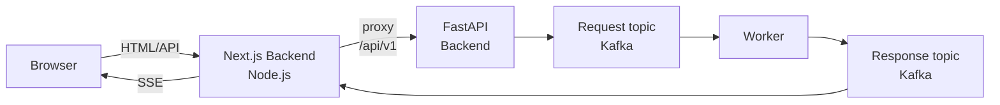

# next-fastapi-sse

A development stack using:

* [Next.js](https://nextjs.org/) 13
* [FastAPI](https://fastapi.tiangolo.com/)
* [Apache Kafka](https://kafka.apache.org/)

supporting:

* [SSE (Server-sent Events)](https://developer.mozilla.org/en-US/docs/Web/API/Server-sent_events/Using_server-sent_events)



## Prerequisites

* [Node.js](https://nodejs.org/en/)
* [pnpm](https://pnpm.io/)
* [Python](https://www.python.org/)
* [Poetry](https://python-poetry.org/)
* [Apache Kafka](https://kafka.apache.org/)

## Setup

Install NPM packages:

```sh
pnpm i
```

Install Python packages:

```sh
cd backend
poetry install
```

Create Kafka topics:

```sh
pnpm run topics:create
```

Start worker:

```sh
pnpm run worker:run
```

Start back-end:

```sh
pnpm run backend:dev
```

Start front-end:

```sh
pnpm run dev
```

### Environment Variables

Both front-end and back-end load environment variables from `.env.development`, `.env.local` and `.env`. The variables required for development are defined in `.env.development`. Create `.env.local` or `.env` to overwrite them.

See startup scripts `scripts/dev.sh`, `scripts/backend/dev.sh` and the following Nex.js document for more details.

* [Basic Features: Environment Variables | Next.js](https://nextjs.org/docs/basic-features/environment-variables)
